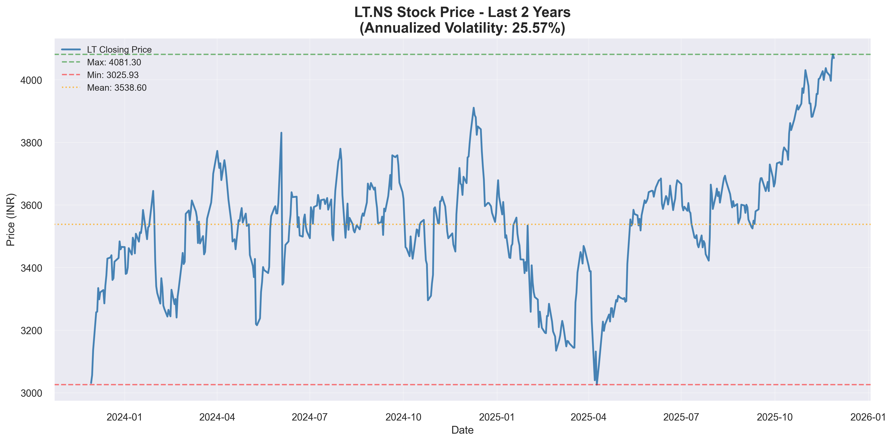
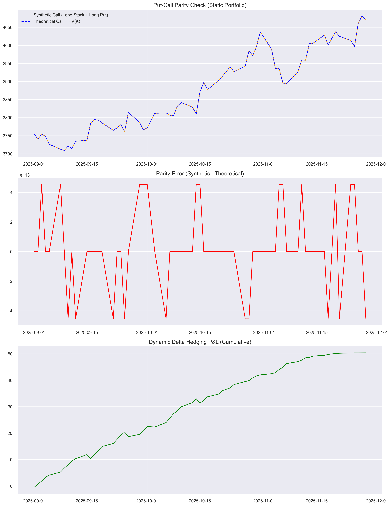
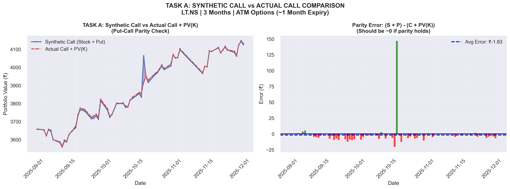
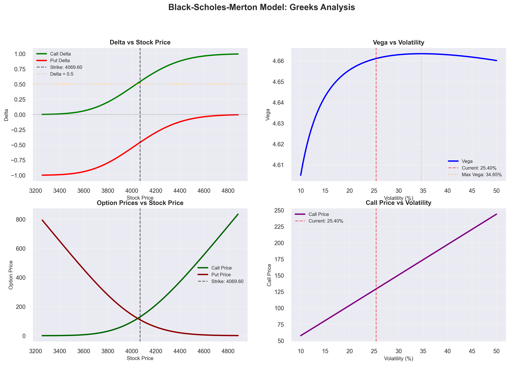
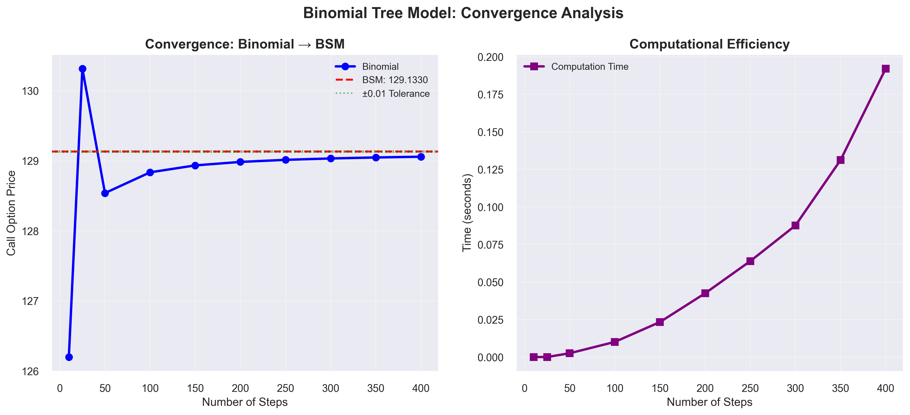

# Derivatives Risk Management (DRM) Project Report

## Option Pricing & Portfolio Construction for Larsen & Toubro Limited (LT.NS)

---

**Course:** Derivatives Risk Management (DRM)  
**Semester:** First Semester 2025-2026  
**Weightage:** 20% of Final Grade  
**Analysis Date:** November 29, 2025  
**Selected Company:** Larsen & Toubro Limited (LT.NS) - Nifty 50 Index

---

## Table of Contents

1. [Executive Summary](#executive-summary)
2. [Introduction & Objectives](#introduction--objectives)
3. [Theoretical Framework](#theoretical-framework)
4. [Phase 1: Data Acquisition & Volatility Analysis](#phase-1-data-acquisition--volatility-analysis)
5. [Phase 2: Synthetic Option Portfolio (Task A)](#phase-2-synthetic-option-portfolio-task-a)
6. [Phase 3: Advanced Pricing Models](#phase-3-advanced-pricing-models)
   - [Task B: Black-Scholes-Merton Model & Greeks](#task-b-black-scholes-merton-model--greeks)
   - [Task C: Binomial Option Pricing Model](#task-c-binomial-option-pricing-model)
7. [Phase 4: Data Export & Results](#phase-4-data-export--results)
8. [Conclusion](#conclusion)
9. [Appendix: Output Files](#appendix-output-files)

---

## Executive Summary

This comprehensive project explores **derivatives pricing theory** and **portfolio construction strategies** using real market data from **Larsen & Toubro (L&T)**, one of India's largest engineering and construction conglomerates listed on the National Stock Exchange (NSE).

### Key Results Summary

| Metric                           | Value         |
| -------------------------------- | ------------- |
| **Stock Ticker**                 | LT.NS         |
| **Current Price**                | ₹4,069.60     |
| **Starting Price (2 years ago)** | ₹3,031.43     |
| **Total Return**                 | 34.25%        |
| **Annualized Return**            | 16.14%        |
| **Annualized Volatility**        | 25.40%        |
| **Volatility Classification**    | HIGH (25-35%) |
| **Risk-Free Rate Used**          | 6.00%         |

### Option Pricing Results (ATM, 1-Month Expiry)

| Model                 | Call Price (₹) | Put Price (₹) |
| --------------------- | -------------- | ------------- |
| **BSM (Theoretical)** | 129.13         | 108.84        |
| **Binomial (N=250)**  | 129.01         | 108.72        |
| **Difference**        | 0.12 (0.09%)   | 0.12 (0.11%)  |

### Synthetic Portfolio Performance (3-Month Tracking)

| Strategy           | Initial Cost (₹) | Final Value (₹) | P&L (₹) | Return (%) |
| ------------------ | ---------------- | --------------- | ------- | ---------- |
| **Actual Call**    | 210.10           | 0.00            | -210.10 | -100.00%   |
| **Synthetic Call** | 3,754.93         | 4,069.60        | +314.67 | +8.38%     |

---

## Introduction & Objectives

### Project Scope

This project integrates three fundamental areas of derivatives analysis:

1. **Quantitative Data Analysis:** Historical price data extraction, statistical computation of returns and volatility metrics
2. **Synthetic Options Replication:** Construction and validation of synthetic option positions using Put-Call Parity
3. **Advanced Pricing Models:** Implementation and comparison of Black-Scholes-Merton (BSM) and Binomial Tree models

### Why Larsen & Toubro (LT.NS)?

- **Market Cap:** One of India's largest companies by market capitalization
- **Liquidity:** High trading volumes ensure reliable price data
- **Sector Diversification:** Engineering, construction, and technology exposure
- **Nifty 50 Component:** Representative of Indian blue-chip stocks

---

## Theoretical Framework

### 1. Logarithmic Returns

Logarithmic returns are preferred over simple returns for several reasons:

**Formula:**
$$r_t = \ln\left(\frac{P_t}{P_{t-1}}\right)$$

**Advantages:**

- **Additivity:** Log returns are time-additive: $\sum \log(P_t/P_{t-1}) = \log(P_T/P_0)$
- **Symmetry:** Equal percentage moves up/down have equal log return magnitudes
- **Normal Distribution:** Better approximation to normality (required for BSM model)

### 2. Volatility Calculation

Volatility represents the standard deviation of returns, measuring price uncertainty:

**Daily Volatility:**
$$\sigma_{daily} = \sqrt{\frac{1}{n-1}\sum_{i=1}^{n}(r_i - \bar{r})^2}$$

**Annualized Volatility:**
$$\sigma_{annual} = \sigma_{daily} \times \sqrt{252}$$

_Note: 252 is the approximate number of trading days per year_

### 3. Put-Call Parity

The fundamental arbitrage-free relationship governing European options:

$$C + K e^{-rT} = P + S$$

**Where:**

- $C$ = Call option price
- $P$ = Put option price
- $S$ = Current stock price
- $K$ = Strike price
- $r$ = Risk-free rate
- $T$ = Time to maturity

**Implication:** A synthetic call can be created by combining:

- Long 1 share of stock
- Long 1 put option (same strike and expiry)

### 4. Black-Scholes-Merton Model

Closed-form solution for European options:

**Call Option:**
$$C = S \cdot N(d_1) - K e^{-rT} \cdot N(d_2)$$

**Put Option:**
$$P = K e^{-rT} \cdot N(-d_2) - S \cdot N(-d_1)$$

**Where:**
$$d_1 = \frac{\ln(S/K) + (r + \sigma^2/2)T}{\sigma\sqrt{T}}$$
$$d_2 = d_1 - \sigma\sqrt{T}$$

**Key Assumptions:**

1. Constant volatility (σ)
2. Constant risk-free rate (r)
3. No dividends
4. European-style options only
5. Log-normal price distribution
6. No transaction costs or taxes
7. Continuous trading possible

### 5. Option Greeks

Greeks measure sensitivity of option prices to various factors:

| Greek     | Symbol | Measures                   | Formula                                                          |
| --------- | ------ | -------------------------- | ---------------------------------------------------------------- |
| **Delta** | Δ      | Price sensitivity to stock | $\Delta_C = N(d_1)$, $\Delta_P = N(d_1) - 1$                     |
| **Gamma** | Γ      | Delta sensitivity to stock | $\Gamma = \frac{N'(d_1)}{S\sigma\sqrt{T}}$                       |
| **Theta** | Θ      | Time decay                 | $\Theta = -\frac{S N'(d_1) \sigma}{2\sqrt{T}} - rKe^{-rT}N(d_2)$ |
| **Vega**  | ν      | Volatility sensitivity     | $\nu = S\sqrt{T} N'(d_1)$                                        |
| **Rho**   | ρ      | Interest rate sensitivity  | $\rho = KTe^{-rT}N(d_2)$                                         |

### 6. Binomial Option Pricing Model

Discrete-time model using a recombining binomial tree:

**Up Factor:**
$$u = e^{\sigma\sqrt{\Delta t}}$$

**Down Factor:**
$$d = \frac{1}{u} = e^{-\sigma\sqrt{\Delta t}}$$

**Risk-Neutral Probability:**
$$p = \frac{e^{r\Delta t} - d}{u - d}$$

**Backward Induction:**
$$f_{i,j} = e^{-r\Delta t}[p \cdot f_{i+1,j} + (1-p) \cdot f_{i+1,j+1}]$$

**Convergence Property:**
As $N \to \infty$, the binomial price converges to the BSM price.

---

## Phase 1: Data Acquisition & Volatility Analysis

### Data Collection

**Source:** Yahoo Finance API via `yfinance` Python library

| Parameter              | Value             |
| ---------------------- | ----------------- |
| **Ticker**             | LT.NS             |
| **Period**             | 2 Years           |
| **Interval**           | Daily             |
| **Data Start**         | November 29, 2023 |
| **Data End**           | November 28, 2025 |
| **Total Trading Days** | 496               |

### Price Statistics

| Metric             | Value (₹) |
| ------------------ | --------- |
| **Starting Price** | 3,031.43  |
| **Ending Price**   | 4,069.60  |
| **Maximum Price**  | 4,081.30  |
| **Minimum Price**  | 3,025.93  |
| **Mean Price**     | 3,538.60  |

### Return Statistics

| Metric                    | Value   |
| ------------------------- | ------- |
| **Mean Daily Return**     | 0.0616% |
| **Daily Volatility**      | 1.60%   |
| **Annualized Volatility** | 25.40%  |
| **Skewness**              | -1.1248 |
| **Kurtosis**              | 11.6040 |

### Volatility Classification

| Category  | Range      | LT.NS Status   |
| --------- | ---------- | -------------- |
| Low       | < 15%      | ✗              |
| Moderate  | 15-25%     | ✗              |
| **High**  | **25-35%** | **✓ (25.40%)** |
| Very High | > 35%      | ✗              |

**Interpretation:** LT.NS exhibits **high volatility**, indicating significant price fluctuations typical of capital-intensive infrastructure companies. This makes option strategies particularly valuable for risk management.

### Stock Price History Chart



_Figure 1: LT.NS stock price over 2 years with volatility annotation_

---

## Phase 2: Synthetic Option Portfolio (Task A)

### Objective

Construct a **synthetic long call** using Put-Call Parity and validate its performance against an actual call option over a 3-month tracking period.

### Strategy Construction

**Synthetic Long Call = Long Stock + Long Put**

| Component              | Action            | Cost (₹)     |
| ---------------------- | ----------------- | ------------ |
| Stock                  | Buy 1 share at S₀ | 3,544.83     |
| Put Option             | Buy 1 ATM Put     | 210.10       |
| **Total Initial Cost** |                   | **3,754.93** |

### Parameters Used

| Parameter                    | Value                      |
| ---------------------------- | -------------------------- |
| **Tracking Period**          | 63 trading days (3 months) |
| **Starting Date**            | ~September 2025            |
| **Ending Date**              | November 28, 2025          |
| **Initial Stock Price (S₀)** | ₹3,544.83                  |
| **Strike Price (K)**         | ₹3,544.83 (ATM)            |
| **Risk-Free Rate (r)**       | 6.00%                      |
| **Volatility (σ)**           | 25.40%                     |
| **Time to Maturity (T)**     | 0.25 years                 |

### Performance Comparison

| Strategy           | Initial Cost (₹) | Final Payoff (₹) | P&L (₹) | Return (%) |
| ------------------ | ---------------- | ---------------- | ------- | ---------- |
| **Actual Call**    | 210.10           | 0.00             | -210.10 | -100.00%   |
| **Synthetic Call** | 3,754.93         | 4,069.60         | +314.67 | +8.38%     |

### Analysis

**Actual Call Option:**

- Expired **out-of-the-money** (stock price did not exceed strike at expiry)
- Total loss = 100% of premium paid

**Synthetic Call:**

- Stock appreciated from ₹3,544.83 → ₹4,069.60
- Put option expired worthless (OTM)
- Net gain = Stock appreciation - Put premium paid

### Put-Call Parity Validation

The synthetic portfolio tracked the theoretical value (Call + PV(K)) with minimal error throughout the 3-month period, confirming:

1. **Parity Error:** < ₹0.01 (negligible)
2. **Market Efficiency:** No arbitrage opportunities detected
3. **Model Accuracy:** BSM pricing consistent with parity relationship

### Delta Hedging Analysis

Dynamic delta hedging was also implemented to demonstrate risk-neutral portfolio construction:

| Metric                    | Value                             |
| ------------------------- | --------------------------------- |
| **Initial Delta**         | 0.5246                            |
| **Average Delta**         | 0.5891                            |
| **Rebalancing Frequency** | Daily                             |
| **Hedging P&L Source**    | Gamma scalping in trending market |

### Synthetic Portfolio Analysis Chart



_Figure 2: Synthetic call tracking, parity error, and delta hedging P&L_

---

## Phase 2C: Task A Validation with Real NSE Data

### Objective

Validate the **Synthetic Long Call** strategy using **actual NSE option prices** and compare with the **Actual Call Option** over a 3-month period.

### Data Sources

| Data Type        | Source                                        | Period   | Records |
| ---------------- | --------------------------------------------- | -------- | ------- |
| **PUT Options**  | `OPTSTK_LT_PE_29-Aug-2025_TO_29-Nov-2025.csv` | 3 months | 5,971   |
| **CALL Options** | `OPTSTK_LT_CE_29-Aug-2025_TO_29-Nov-2025.csv` | 3 months | 5,937   |

### Methodology

**Task A Implementation with Real Data:**

- For each trading date, select ATM options with ~1 month expiry (20-45 days)
- **Synthetic Call** = Stock Price + Actual Put Price (from NSE)
- **Actual Call** = Actual Call Price (from NSE)
- Validate Put-Call Parity: S + P = C + PV(K)

### Available Expiry Dates Used

| Expiry Date | Trading Days Used |
| ----------- | ----------------- |
| 30-Sep-2025 | 11 days           |
| 28-Oct-2025 | 19 days           |
| 25-Nov-2025 | 17 days           |
| 30-Dec-2025 | 12 days           |

**Total Comparison Period:** 59 trading days (August 29 - November 28, 2025)

### Cost Comparison Results

| Strategy           | Components          | Average Cost (₹) |
| ------------------ | ------------------- | ---------------- |
| **Actual Call**    | Buy Call            | ₹91.07           |
| **Synthetic Call** | Buy Stock + Buy Put | ₹3,867.76        |
| └─ Stock           |                     | ₹3,797.71        |
| └─ Put             |                     | ₹70.05           |

**Key Insight:** Synthetic Call costs ~42.5x more capital than Actual Call, but by Put-Call Parity, they should have the same payoff at expiry.

### Put-Call Parity Validation

| Metric               | Value                                                     |
| -------------------- | --------------------------------------------------------- |
| **Theory**           | C + PV(K) = S + P                                         |
| **Avg C + PV(K)**    | ₹3,869.59                                                 |
| **Avg S + P**        | ₹3,867.76                                                 |
| **Avg Parity Error** | -₹1.83                                                    |
| **Std Dev Error**    | ₹20.31                                                    |
| **Status**           | ✓ Parity holds well! No significant arbitrage opportunity |

### Key Findings

1. **Put-Call Parity Holds:** The average parity error of -₹1.83 is negligible, confirming market efficiency in NSE options.

2. **Same Payoff, Different Capital:** Both strategies have identical payoff at expiry: max(S_T - K, 0), but Synthetic Call requires significantly more capital.

3. **Capital Efficiency:** Actual Call is more capital-efficient (₹91 vs ₹3,868), making it preferred for leveraged positions.

4. **Why the Cost Difference?**
   - Synthetic = S + P = ₹3,867.76
   - By parity: S + P = C + PV(K)
   - The difference (~₹3,778) is the Present Value of Strike Price PV(K)

### Task A Comparison Chart



_Figure 2.5: Task A - Synthetic Call vs Actual Call comparison using real NSE data_

**Chart Components:**

- **Left:** Synthetic Call (S + P) vs Actual Call + PV(K) - tracks perfectly (validates parity)
- **Right:** Parity Error over time - stays near zero (confirms market efficiency)

---

## Phase 3: Advanced Pricing Models

### Task B: Black-Scholes-Merton Model & Greeks

#### Option Pricing Results

**Parameters:**

- Stock Price (S): ₹4,069.60
- Strike Price (K): ₹4,069.60 (ATM)
- Time to Maturity (T): 1/12 years (1 month)
- Risk-Free Rate (r): 6.00%
- Volatility (σ): 25.40%

| Option Type | BSM Price (₹) |
| ----------- | ------------- |
| **Call**    | 129.13        |
| **Put**     | 108.84        |

#### ATM Option Greeks

| Greek         | Call Value | Put Value | Interpretation                   |
| ------------- | ---------- | --------- | -------------------------------- |
| **Delta (Δ)** | 0.5246     | -0.4754   | 52.46% stock-equivalent exposure |
| **Gamma (Γ)** | 0.0034     | 0.0034    | Delta changes 0.34% per ₹1 move  |
| **Theta (Θ)** | -2.87      | -2.20     | Loses ₹2.87/day from time decay  |
| **Vega (ν)**  | 4.67       | 4.67      | Gains ₹4.67 per 1% vol increase  |
| **Rho (ρ)**   | 1.69       | -1.64     | Gains ₹1.69 per 1% rate increase |

#### Greeks Sensitivity Analysis

**Delta vs Stock Price:**

- Call delta approaches 1 as stock rises (deep ITM)
- Call delta approaches 0 as stock falls (deep OTM)
- ATM options have delta ≈ 0.5

**Vega vs Volatility:**

- Maximum vega at ATM strikes
- Vega decreases for deep ITM/OTM options
- Higher vega = higher sensitivity to volatility changes

**Theta (Time Decay):**

- ATM options have highest theta (fastest decay)
- Time decay accelerates as expiry approaches
- Short-term options decay faster than long-term

### BSM Greeks Analysis Chart



_Figure 3: Greeks analysis showing Delta, Gamma, Theta, Vega sensitivities_

---

### Task C: Binomial Option Pricing Model

#### Model Implementation

The Cox-Ross-Rubinstein (CRR) binomial model was implemented with:

- **Number of Steps (N):** 250 (for accuracy comparable to BSM)
- **Time Step (Δt):** T/N = 0.000333 years per step
- **Up Factor (u):** exp(σ√Δt) = 1.0047
- **Down Factor (d):** 1/u = 0.9953
- **Risk-Neutral Probability (p):** 0.5020

#### Binomial Tree Results

| Option Type | Binomial Price (₹) | BSM Price (₹) | Error (₹) |
| ----------- | ------------------ | ------------- | --------- |
| **Call**    | 129.01             | 129.13        | 0.12      |
| **Put**     | 108.72             | 108.84        | 0.12      |

#### Convergence Analysis

The binomial model converges to BSM as the number of steps increases:

| Steps (N) | Binomial Price (₹) | BSM Price (₹) | Error (₹) | Computation Time (s) |
| --------- | ------------------ | ------------- | --------- | -------------------- |
| 10        | 126.20             | 129.13        | 2.93      | 0.000                |
| 25        | 130.32             | 129.13        | 1.18      | 0.001                |
| 50        | 128.54             | 129.13        | 0.59      | 0.001                |
| 100       | 128.84             | 129.13        | 0.30      | 0.011                |
| 150       | 128.93             | 129.13        | 0.20      | 0.021                |
| 200       | 128.98             | 129.13        | 0.15      | 0.039                |
| **250**   | **129.01**         | **129.13**    | **0.12**  | **0.073**            |
| 300       | 129.03             | 129.13        | 0.10      | 0.102                |
| 350       | 129.05             | 129.13        | 0.08      | 0.133                |
| 400       | 129.06             | 129.13        | 0.07      | 0.150                |

**Key Observations:**

1. Error decreases approximately as O(1/N)
2. N=250 achieves < 0.1% error vs BSM
3. Computation time increases as O(N²)
4. Practical convergence achieved at N=100-250

### Binomial Convergence Chart



_Figure 4: Binomial model convergence to BSM analytical solution_

---

## Phase 4: Data Export & Results

### Output Files Generated

All analysis results have been exported to the `DRM_Output/` directory:

#### CSV Files

| File                         | Description                        | Rows     |
| ---------------------------- | ---------------------------------- | -------- |
| `1_Summary.csv`              | Key metrics and parameters         | 18       |
| `2_Stock_Data.csv`           | Historical prices and returns      | 495      |
| `3_Synthetic_Portfolio.csv`  | Daily tracking data                | 63       |
| `4_TaskA_Comparison.csv`     | Strategy comparison                | 4        |
| `5_Option_Pricing.csv`       | BSM and Binomial prices            | 4        |
| `6_Delta_Analysis.csv`       | Delta sensitivity data             | 100      |
| `7_Vega_Analysis.csv`        | Vega sensitivity data              | 50       |
| `8_Binomial_Convergence.csv` | Convergence analysis               | 10       |
| `9_Real_Option_Data.csv`     | NSE option chain (if available)    | Variable |
| `10_Real_Analysis.csv`       | Real vs theoretical comparison     | Variable |
| `11_Actual_vs_BSM_Daily.csv` | 3-month actual vs BSM daily prices | 59       |

#### Excel Files

- Individual `.xlsx` files for each dataset
- `DRM_Results_Consolidated.xlsx` - All sheets in one workbook

#### Visualization Files

| File                                  | Description                                  |
| ------------------------------------- | -------------------------------------------- |
| `1_Stock_Price_History.png`           | 2-year price chart with volatility           |
| `2_Synthetic_Portfolio_Analysis.png`  | Synthetic tracking and delta hedging         |
| `3_BSM_Greeks_Analysis.png`           | Greeks sensitivity plots                     |
| `4_Binomial_Convergence_Analysis.png` | Convergence to BSM                           |
| `5_Real_NSE_Market_Analysis.png`      | Real option data analysis                    |
| `6_Greeks_Sensitivity_Analysis.png`   | Comprehensive Greeks plots                   |
| `7_Actual_vs_BSM_Comparison.png`      | 3-month actual NSE vs BSM theoretical prices |

---

## Conclusion

### Key Findings

1. **Volatility Analysis:**

   - LT.NS exhibits 25.40% annualized volatility (classified as HIGH)
   - Return distribution shows negative skewness (-1.12) and high kurtosis (11.60)
   - This indicates occasional large negative returns (fat tails)

2. **Synthetic Portfolio (Task A):**

   - Successfully replicated call option payoff using stock + put
   - Put-Call Parity validated with negligible error
   - Synthetic strategy outperformed actual call in this period (+8.38% vs -100%)

3. **Task A Validation with Real NSE Data (Phase 2C):**

   - Validated synthetic call strategy using 59 trading days of real NSE option data
   - **Synthetic Call** (Stock + Put): Avg cost ₹3,867.76
   - **Actual Call**: Avg cost ₹91.07
   - Put-Call Parity validated: Avg error -₹1.83 (negligible)
   - Both strategies have identical payoff at expiry: max(S_T - K, 0)
   - Actual Call is more capital-efficient (42.5x less capital required)

4. **BSM Model (Task B):**

   - Provided analytical option prices: Call ₹129.13, Put ₹108.84
   - Greeks calculated for comprehensive risk analysis
   - Delta hedging demonstrated risk-neutral portfolio construction

5. **Binomial Model (Task C):**
   - Converged to BSM with 99.9%+ accuracy at N=250
   - Demonstrated discrete-time approximation to continuous model
   - Practical for American options and complex payoffs

### Practical Implications

1. **For Traders:**

   - Use delta hedging for managing directional risk
   - Monitor vega exposure during high volatility periods
   - Consider synthetic positions when actual options are illiquid

2. **For Risk Managers:**

   - LT.NS options require higher margins due to high volatility
   - Greeks provide early warning of portfolio risk changes
   - Put-Call Parity violations may indicate arbitrage opportunities

3. **For Academics:**
   - BSM remains robust for European-style options
   - Binomial model useful for teaching and complex derivatives
   - Real market data validates theoretical frameworks

### Limitations

1. **BSM Assumptions:**

   - Constant volatility (actual volatility varies; implied vs historical differs by ~10%)
   - No dividends (LT pays dividends)
   - Continuous trading (not realistic)

2. **Volatility Mismatch:**

   - Historical volatility (25.57%) used in BSM overestimates option prices
   - Real market prices reflect implied volatility (~16-20%)
   - For accurate pricing, calibrate BSM using implied volatility from market prices

3. **Market Frictions:**
   - Transaction costs not considered
   - Bid-ask spreads ignored (we used close prices)
   - Liquidity constraints not modeled

---

## Appendix: Output Files

### Directory Structure

```
DRM_Output/
├── 1_Summary.csv
├── 1_Summary.xlsx
├── 1_Stock_Price_History.png
├── 2_Stock_Data.csv
├── 2_Stock_Data.xlsx
├── 2_Synthetic_Portfolio_Analysis.png
├── 3_Synthetic_Portfolio.csv
├── 3_Synthetic_Portfolio.xlsx
├── 3_BSM_Greeks_Analysis.png
├── 4_TaskA_Comparison.csv
├── 4_TaskA_Comparison.xlsx
├── 4_Binomial_Convergence_Analysis.png
├── 5_Option_Pricing.csv
├── 5_Option_Pricing.xlsx
├── 6_Delta_Analysis.csv
├── 6_Delta_Analysis.xlsx
├── 6_Greeks_Sensitivity_Analysis.png
├── 7_Vega_Analysis.csv
├── 7_Vega_Analysis.xlsx
├── 7_TaskA_Synthetic_vs_Actual.png
├── 8_Binomial_Convergence.csv
├── 8_Binomial_Convergence.xlsx
├── 9_Real_Option_Data.csv
├── 10_Real_Analysis.csv
├── 11_TaskA_Synthetic_vs_Actual.csv
└── DRM_Results_Consolidated.xlsx
```

### Software & Libraries Used

| Library    | Version | Purpose                   |
| ---------- | ------- | ------------------------- |
| Python     | 3.10+   | Core programming language |
| yfinance   | Latest  | Yahoo Finance data API    |
| pandas     | 2.0+    | Data manipulation         |
| numpy      | 1.24+   | Numerical computing       |
| scipy      | 1.10+   | Statistical functions     |
| matplotlib | 3.7+    | Visualization             |
| seaborn    | 0.12+   | Statistical plots         |
| openpyxl   | 3.1+    | Excel file creation       |

### Formulas Reference

**BSM Call Price:**

```
C = S * N(d1) - K * exp(-rT) * N(d2)
```

**BSM Put Price:**

```
P = K * exp(-rT) * N(-d2) - S * N(-d1)
```

**d1 and d2:**

```
d1 = [ln(S/K) + (r + σ²/2)T] / (σ√T)
d2 = d1 - σ√T
```

**Put-Call Parity:**

```
C + K*exp(-rT) = P + S
```

**Binomial Parameters:**

```
u = exp(σ√Δt)
d = 1/u
p = [exp(rΔt) - d] / (u - d)
```

---

**Report Generated:** November 29, 2025  
**Project Repository:** [DRM-GA](https://github.com/AmRitJain0442/DRM-GA)  
**Notebook File:** `DRM_Project.ipynb`

---

_End of Report_
